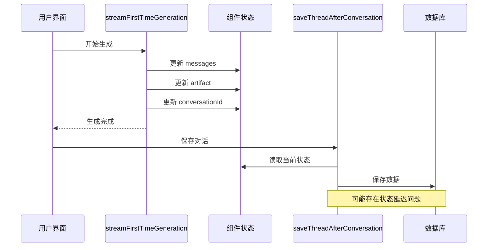
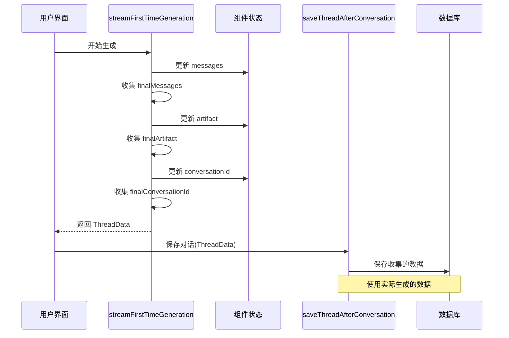

# Thread 数据返回优化

## 背景

用户要求优化 `streamFirstTimeGeneration` 函数，使其返回对话数据（`allThreadData`），然后在 `saveThreadAfterConversation` 中使用这些数据进行存储。

## 实现的修改

### 1. 新增数据类型定义

```typescript
// 定义对话数据类型
interface ThreadData {
  messages: BaseMessage[];
  artifact?: ArtifactV3;
  conversationId?: string;
}
```

### 2. 修改 `streamFirstTimeGeneration` 函数

**函数签名变更**：
```typescript
// 之前
const streamFirstTimeGeneration = async (params: GraphInput) => {

// 之后  
const streamFirstTimeGeneration = async (params: GraphInput): Promise<ThreadData> => {
```

**数据收集逻辑**：
```typescript
// 初始化返回数据
let finalMessages: BaseMessage[] = [];
let finalArtifact: ArtifactV3 | undefined;
let finalConversationId: string | undefined;

// 在生成过程中收集数据
if (data.conversation_id && !receivedConversationId) {
  receivedConversationId = data.conversation_id;
  setConversationId(receivedConversationId);
  finalConversationId = receivedConversationId; // 新增
}

// 收集 artifact 数据
setArtifact(newArtifact);
finalArtifact = newArtifact; // 新增

// 收集消息数据
setMessages((prevMessages) => {
  // ... 消息处理逻辑
  finalMessages = newMessages; // 新增
  return newMessages;
});
```

**返回数据**：
```typescript
// 返回收集的对话数据
return {
  messages: finalMessages,
  artifact: finalArtifact,
  conversationId: finalConversationId,
};
```

### 3. 修改 `saveThreadAfterConversation` 函数

**函数签名变更**：
```typescript
// 之前
const saveThreadAfterConversation = async (threadId: string, params: GraphInput) => {

// 之后
const saveThreadAfterConversation = async (threadId: string, params: GraphInput, threadData?: ThreadData) => {
```

**数据使用逻辑**：
```typescript
// 更新 Thread 的状态，包括消息和 artifacts
const updateData: any = {
  values: {
    // 优先使用传入的 threadData，否则使用当前状态
    messages: threadData?.messages || messages,
  },
};

// 如果有 artifact，也保存
const artifactToSave = threadData?.artifact || artifact;
if (artifactToSave) {
  updateData.values.artifact = artifactToSave;
}
```

### 4. 更新调用逻辑

**在 `streamMessageV2` 中**：
```typescript
// 第一种交互模式：第一次生成新artifact
const allThreadData = await streamFirstTimeGeneration(params);

// 对话结束后，如果是新线程，更新 thread 标题和保存完整状态
if (isNewThread && currentThreadId) {
  await saveThreadAfterConversation(currentThreadId, params, allThreadData);
}
```

## 优化效果

### 1. 数据一致性
- **问题**：之前使用组件状态（`messages`, `artifact`）可能存在时序问题
- **解决**：现在直接使用生成过程中收集的实际数据

### 2. 数据完整性
- **问题**：状态更新可能有延迟，导致保存的数据不完整
- **解决**：在生成过程中实时收集所有相关数据

### 3. 可扩展性
- **问题**：其他对话函数（重写、编辑）也需要类似的数据收集
- **解决**：提供了可扩展的模式，其他函数可以采用相同的方式

## 数据流对比

### 优化前


### 优化后


## 待完成的工作

### 1. 其他对话函数
需要为以下函数也实现类似的数据返回机制：
- `streamRewriteArtifact`
- `streamRewriteHighlightedText`

### 2. 错误处理
增强错误情况下的数据收集和处理。

### 3. 类型安全
进一步完善 TypeScript 类型定义，确保类型安全。

## 技术债务

### 解决的问题 ✅
- ✅ 数据收集和保存的时序问题
- ✅ 状态更新延迟导致的数据不一致

### 新增的技术债务 ⚠️
- ⚠️ 其他对话函数还没有实现相同的模式
- ⚠️ 错误处理路径的数据收集需要完善

## 总结

这次优化显著提升了数据保存的可靠性和一致性，通过直接收集生成过程中的实际数据，避免了依赖组件状态可能带来的时序问题。这为未来的功能扩展奠定了良好的基础。 