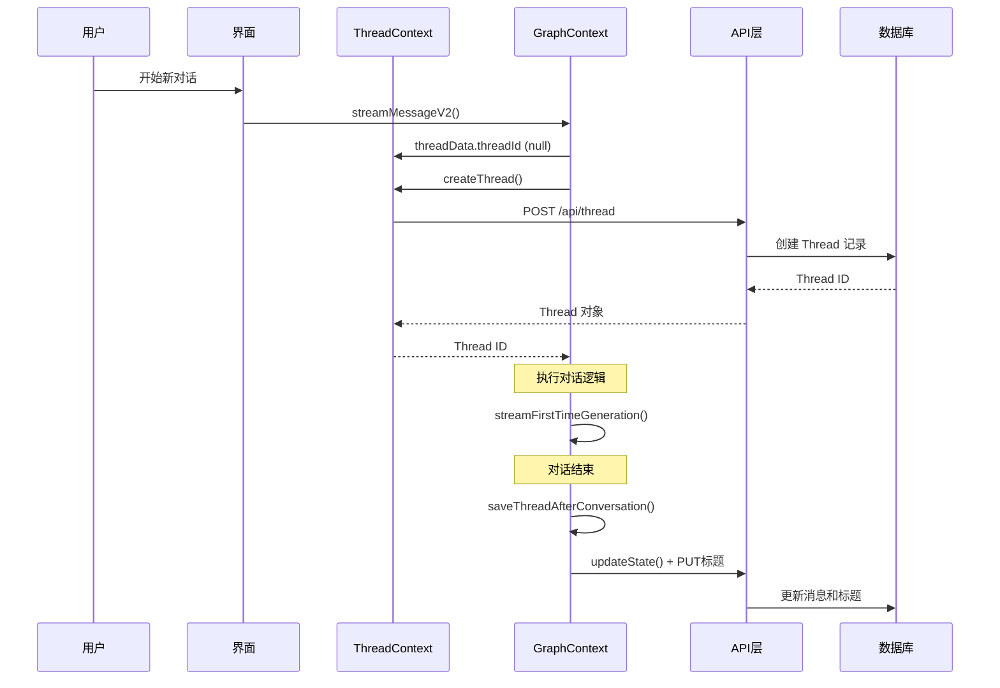
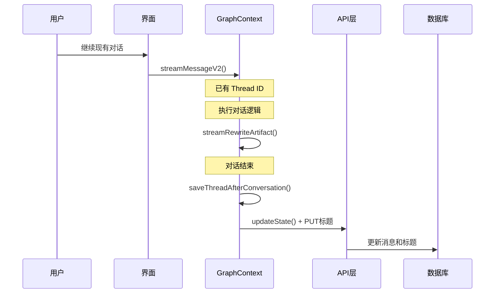

# Thread 生命周期优化

## 背景

用户提出了一个重要的优化需求：当创建新的 Thread 时，需要立即存储到数据库，然后在对话结束后再更新相关信息（如标题、最终状态等）。

## 原有问题

1. **Thread 创建时机不合理**：只有在第一次对话时才创建，导致用户看不到线程
2. **标题设置不及时**：新创建的线程没有合理的初始标题
3. **状态保存不完整**：对话结束后没有统一保存消息和 artifacts

## 优化方案

### 1. Thread 创建优化

**修改文件**：`apps/web/src/contexts/ThreadProvider.tsx`

```typescript
const createThread = async (initialTitle?: string): Promise<Thread | undefined> => {
  // ...
  const thread = await client.threads.create({
    metadata: {
      supabase_user_id: user.id,
      customModelName: modelName,
      modelConfig: { ... },
      // 设置合理的初始标题
      thread_title: initialTitle || `New Chat - ${new Date().toLocaleString()}`,
    },
  });
  // ...
}
```

**改进点**：
- 支持传入自定义初始标题
- 如果没有提供标题，使用带时间戳的默认标题
- 立即设置到 metadata 中，确保新线程有标识

### 2. 对话流程优化

**修改文件**：`apps/web/src/contexts/GraphContext.tsx`

```typescript
const streamMessageV2 = async (params: GraphInput) => {
  let currentThreadId = threadData.threadId;
  let isNewThread = false;
  
  // 1. 检查是否需要创建新 Thread
  if (!currentThreadId) {
    const newThread = await threadData.createThread();
    currentThreadId = newThread.thread_id;
    isNewThread = true;
  }

  // 2. 执行对话逻辑（生成、重写等）
  await executeConversationLogic(params);
  
  // 3. 对话结束后保存状态
  if (currentThreadId) {
    await saveThreadAfterConversation(currentThreadId, params);
  }
};
```

**改进点**：
- 在对话开始前确保有 Thread ID
- 跟踪是否为新创建的线程
- 在每个对话分支结束后都保存状态

### 3. 状态保存机制

**新增函数**：`saveThreadAfterConversation()`

```typescript
const saveThreadAfterConversation = async (threadId: string, params: GraphInput) => {
  try {
    // 1. 生成对话标题
    const userMessage = params.messages?.[params.messages.length - 1]?.content || "";
    const title = userMessage.length > 50 
      ? userMessage.substring(0, 47) + "..."
      : userMessage || "New Conversation";

    // 2. 更新 Thread 状态
    const updateData = {
      values: {
        messages: messages,
        ...(artifact && { artifact: artifact }),
      },
    };
    
    await client.threads.updateState(threadId, updateData);
    
    // 3. 更新标题
    await fetch(`/api/thread/${threadId}`, {
      method: 'PUT',
      headers: { 'Content-Type': 'application/json' },
      body: JSON.stringify({
        metadata: { thread_title: title },
      }),
    });
    
  } catch (error) {
    console.error("Failed to save thread after conversation:", error);
  }
};
```

**功能特点**：
- 自动从用户消息生成标题（前50字符）
- 保存完整的对话状态（消息 + artifacts）
- 错误处理但不干扰用户体验

## 生命周期流程

### 新对话流程



### 现有对话流程



## 数据流优化

### Thread 创建时

```json
{
  "metadata": {
    "supabase_user_id": "用户ID",
    "customModelName": "gpt-4",
    "modelConfig": { "temperature": 0.7 },
    "thread_title": "New Chat - 2024-01-15 10:30:25"
  },
  "values": {}
}
```

### 对话结束后

```json
{
  "metadata": {
    "thread_title": "创建一个登录页面的React组件..."
  },
  "values": {
    "messages": [
      {
        "type": "human",
        "content": "创建一个登录页面的React组件",
        "sequence_number": 1
      },
      {
        "type": "ai", 
        "content": "我来为你创建一个登录页面组件...",
        "sequence_number": 2
      }
    ],
    "artifact": {
      "currentIndex": 1,
      "contents": [
        {
          "index": 1,
          "type": "code",
          "title": "Login Component",
          "code": "..."
        }
      ]
    }
  }
}
```

## 用户体验改进

### 改进前
- ❌ 新对话时用户看不到线程
- ❌ 线程标题为空或不明确
- ❌ 对话状态可能丢失

### 改进后
- ✅ 立即创建线程，用户可见
- ✅ 有意义的初始标题和最终标题
- ✅ 完整保存对话状态
- ✅ 优雅的错误处理

## 技术细节

### 标题生成规则
1. 使用用户第一条消息的前50个字符
2. 超过50字符时截断并添加"..."
3. 如果没有消息内容，使用"New Conversation"

### 状态保存时机
- 第一次生成 artifact 后
- 重写 artifact 后  
- 高亮编辑后
- 任何对话交互结束后

### 错误处理
- Thread 创建失败：显示错误提示，停止对话
- 状态保存失败：记录错误但不影响用户体验

## 影响范围

1. **ThreadProvider**: 增强 createThread 函数
2. **GraphContext**: 优化对话流程管理
3. **API 层**: 无需修改，使用现有接口
4. **用户界面**: 更好的线程管理体验

这次优化确保了 Thread 的完整生命周期管理，提供了更好的用户体验和数据一致性。 